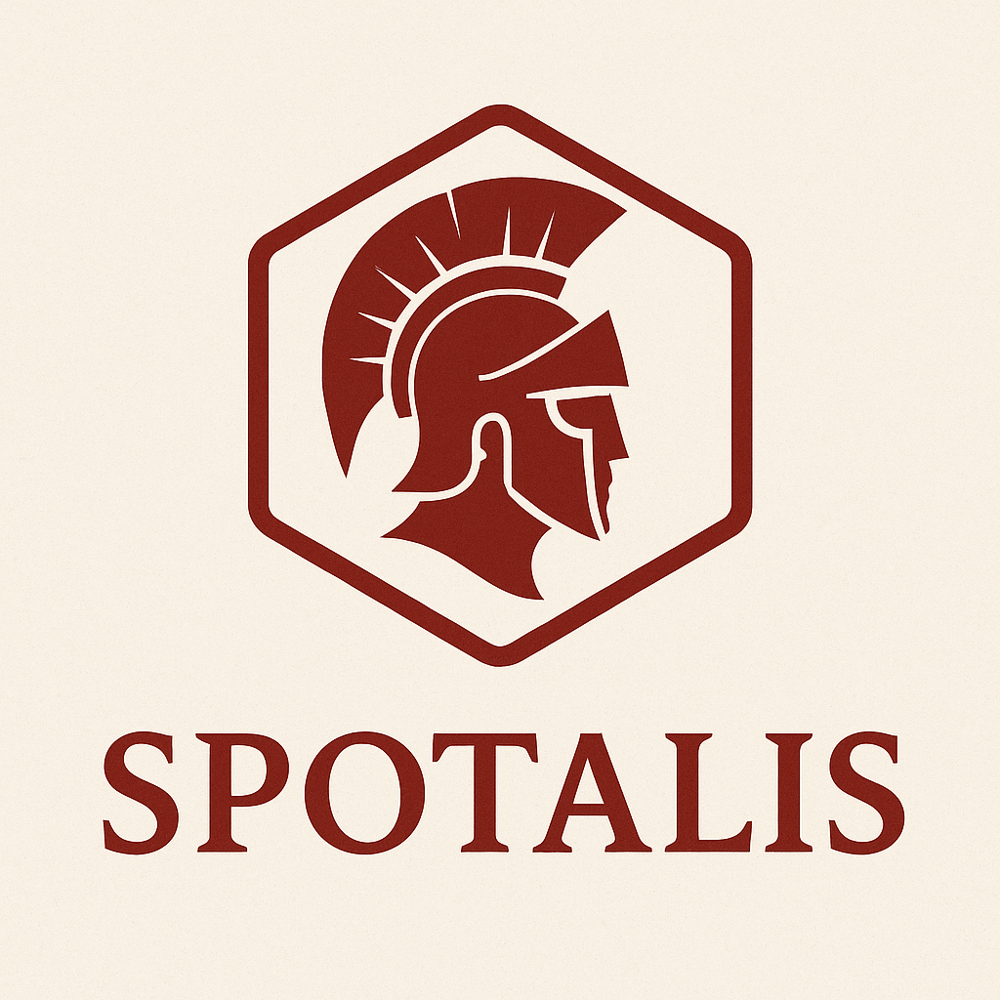

<p align="center">
  
</p>

<h1 align="center">Spotalis</h1>
<p align="center"><strong>Annotation‑first spot vs on‑demand replica optimizer for Kubernetes</strong></p>

---

## ✨ Overview
Spotalis continuously computes a safe distribution of your workloads' replicas across spot and on‑demand capacity based on lightweight labels/annotations:

* Zero custom resource definitions – you opt‑in with a label: `spotalis.io/enabled=true` (namespace or workload)
* Safety guardrails – always honors a minimum on‑demand floor you set
* Deterministic distribution algorithm (see strategy & state docs) with clear metrics
* Single process running controllers + webhook (Karpenter‑style composition)

> Deep rationale: see [architecture](docs/explanation/architecture.md) and [replica distribution strategy](docs/explanation/replica-distribution-strategy.md).

## 🚀 Quick Start
Local success path (Kind): follow the [Kind tutorial](docs/tutorials/run-kind.md).

Production / cluster installation: see the [Helm install how-to](docs/how-to/install-helm.md).

Helm install (placeholder repo URL until published):
```bash
helm repo add spotalis https://example.invalid/spotalis
helm repo update
helm upgrade --install spotalis spotalis/spotalis \
  --namespace spotalis-system --create-namespace
```

Annotate / label a workload (example Deployment):
```yaml
apiVersion: apps/v1
kind: Deployment
metadata:
  name: api
  labels:
    spotalis.io/enabled: "true"          # Opt-in
  annotations:
    spotalis.io/spot-percentage: "70"    # Target 70% spot
    spotalis.io/min-on-demand: "1"       # Always keep at least 1 on-demand replica
spec:
  replicas: 5
  selector:
    matchLabels:
      app: api
  template:
    metadata:
      labels:
        app: api
    spec:
      containers:
        - name: api
          image: ghcr.io/example/api:latest
```

More label/annotation options: see [labels & annotations reference](docs/reference/labels-and-annotations.md).

## 🧠 Core Concepts
| Concept | Where to Read |
|--------|----------------|
| Enablement model | [labels & annotations](docs/reference/labels-and-annotations.md) |
| Distribution algorithm | [replica strategy](docs/explanation/replica-distribution-strategy.md) |
| Runtime & internal state | [state management](docs/reference/state-management.md) |
| Configuration structure + env overrides | [configuration reference](docs/reference/configuration.md) |
| Metrics & scrape ports | [metrics](docs/reference/metrics.md), [runtime ports](docs/reference/runtime-ports.md) |
| Design & trade‑offs | [design choices](docs/explanation/design-choices.md) |
| Debugging pod mutation | [debug mutation how-to](docs/how-to/debug-mutation.md) |
| Tuning spot % safely | [tune spot percentage](docs/how-to/tune-spot-percentage.md) |

## 📊 Observability
Spotalis exposes Prometheus metrics and health endpoints (see [runtime ports](docs/reference/runtime-ports.md)). Key gauges/counters quantify desired vs realized spot/on‑demand replicas so you can alert on drift. See also [metrics reference](docs/reference/metrics.md).

## 🧪 Development
Prereqs: Go (toolchain), a K8s cluster (Kind for local), Helm (optional).

Common tasks:
```bash
make run                 # Run controller against current kube context
make test                # Unit tests
make test-integration    # Integration tests (Kind)
make lint                # Lint (golangci-lint)
make docker-build        # Build container image
```
Configuration example: [`examples/configs/config.yaml`](examples/configs/config.yaml) (see loader docs: [configuration reference](docs/reference/configuration.md)).

## 🔒 Safety Model (High Level)
Spotalis never reduces on‑demand replicas below `spotalis.io/min-on-demand` and reconciles incrementally to avoid thrash. Leader election ensures a single active controller (see [state management](docs/reference/state-management.md)).

Independent controls:
* You can set only `spotalis.io/min-on-demand` to enforce a safety floor while keeping all traffic on on‑demand (omit spot percentage during initial adoption).
* You can set only `spotalis.io/spot-percentage` for pure percentage-driven distribution (implicit floor = 0 unless configured globally).
* When both are set, the floor always overrides percentage math that would go below it.

## 🗺 Documentation Map (Diátaxis)
| Need | Go To |
|------|-------|
| First successful run | [Kind tutorial](docs/tutorials/run-kind.md) |
| Adjust spot/on-demand ratio | [tune spot percentage](docs/how-to/tune-spot-percentage.md) |
| List labels & annotations | [labels & annotations](docs/reference/labels-and-annotations.md) |
| System configuration | [configuration reference](docs/reference/configuration.md) |
| Metrics & ports | [metrics](docs/reference/metrics.md), [runtime ports](docs/reference/runtime-ports.md) |
| Internal state & reconciliation | [state management](docs/reference/state-management.md) |
| General usage / flow | [how it works](docs/explanation/how-it-works.md) |
| Architecture rationale | [architecture](docs/explanation/architecture.md) |
| Strategy math | [replica strategy](docs/explanation/replica-distribution-strategy.md) |
| Design trade-offs | [design choices](docs/explanation/design-choices.md) |
| Debug mutation issues | [debug mutation how-to](docs/how-to/debug-mutation.md) |

## 📄 License
Apache2 ©

---
<sub>Spotalis is early-stage; interfaces and annotation keys may evolve. Track changes via commit history and release notes (future).</sub>